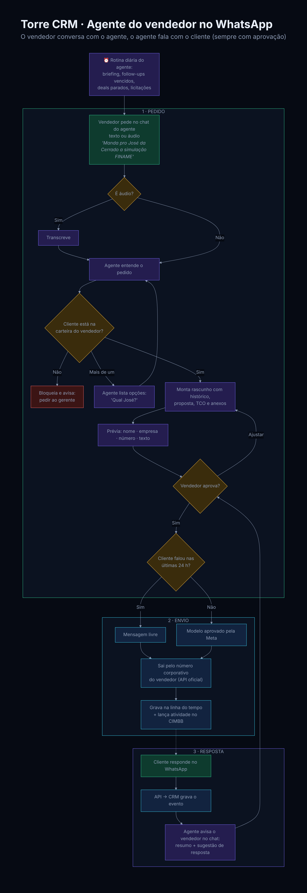
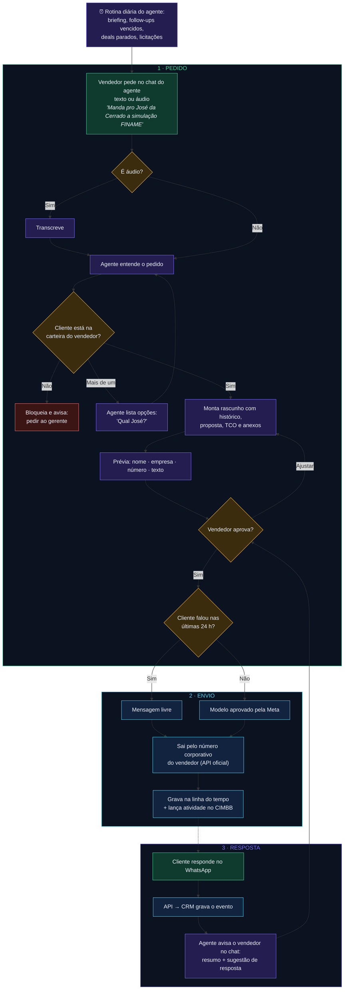

# Agente do vendedor no WhatsApp (Torre CRM)

```mermaid
flowchart TD
  subgraph V["1 · PEDIDO"]
    A["Vendedor pede no chat do agente<br/>texto ou áudio<br/><i>'Manda pro José da Cerrado a simulação FINAME'</i>"]
    A --> B{"É áudio?"}
    B -- Sim --> B1["Transcreve"] --> C
    B -- Não --> C["Agente entende o pedido"]
    C --> D{"Cliente está na<br/>carteira do vendedor?"}
    D -- Não --> D1["Bloqueia e avisa:<br/>pedir ao gerente"]
    D -- "Mais de um" --> D2["Agente lista opções:<br/>'Qual José?'"] --> C
    D -- Sim --> E["Monta rascunho com histórico,<br/>proposta, TCO e anexos"]
    E --> F["Prévia: nome · empresa · número · texto"]
    F --> G{"Vendedor aprova?"}
    G -- Ajustar --> E
    G -- Sim --> H{"Cliente falou nas<br/>últimas 24 h?"}
  end
  subgraph W["2 · ENVIO"]
    H -- Sim --> I["Mensagem livre"]
    H -- Não --> J["Modelo aprovado pela Meta"]
    I --> K["Sai pelo número corporativo<br/>do vendedor (API oficial)"]
    J --> K
    K --> L["Grava na linha do tempo<br/>+ lança atividade no CIMBB"]
  end
  subgraph R["3 · RESPOSTA"]
    M["Cliente responde no WhatsApp"] --> N["API → CRM grava o evento"]
    N --> O["Agente avisa o vendedor no chat:<br/>resumo + sugestão de resposta"]
  end
  L -.-> M
  O --> G
  P["⏰ Rotina diária do agente:<br/>briefing, follow-ups vencidos,<br/>deals parados, licitações"] --> A

  classDef v fill:#0E3B2E,stroke:#34D399,color:#EAF0FA
  classDef p fill:#12233F,stroke:#3DD6F5,color:#EAF0FA
  classDef ia fill:#241D4F,stroke:#7C6CFF,color:#EAF0FA
  classDef d fill:#3A2C0C,stroke:#F5B942,color:#EAF0FA
  classDef x fill:#3B1414,stroke:#FF6B6B,color:#EAF0FA
  class A,M v
  class I,J,K,L,N p
  class B1,C,D2,E,F,O,P ia
  class B,D,G,H d
  class D1 x
  style V fill:#0B1220,stroke:#34D399,color:#34D399
  style W fill:#0B1220,stroke:#3DD6F5,color:#3DD6F5
  style R fill:#0B1220,stroke:#7C6CFF,color:#7C6CFF
```
