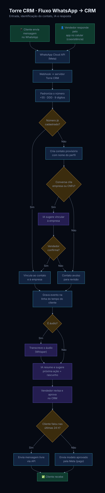
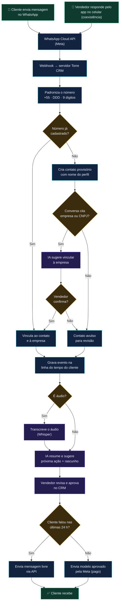

# Fluxo WhatsApp → Torre CRM

```mermaid
flowchart TD
  A["📱 Cliente envia mensagem<br/>no WhatsApp"] --> B["WhatsApp Cloud API<br/>(Meta)"]
  V["👤 Vendedor responde pelo<br/>app no celular (coexistência)"] --> B
  B --> C["Webhook → servidor Torre CRM"]
  C --> D["Padroniza o número<br/>+55 · DDD · 9 dígitos"]
  D --> E{"Número já<br/>cadastrado?"}
  E -- Sim --> F["Vincula ao contato<br/>e à empresa"]
  E -- Não --> G["Cria contato provisório<br/>com nome do perfil"]
  G --> H{"Conversa cita<br/>empresa ou CNPJ?"}
  H -- Sim --> I["IA sugere vincular<br/>à empresa"]
  I --> J{"Vendedor<br/>confirma?"}
  J -- Sim --> F
  J -- Não --> K["Contato avulso<br/>para revisão"]
  H -- Não --> K
  F --> L["Grava evento na<br/>linha do tempo do cliente"]
  K --> L
  L --> M{"É áudio?"}
  M -- Sim --> N["Transcreve o áudio<br/>(Whisper)"]
  N --> O["IA resume e sugere<br/>próxima ação + rascunho"]
  M -- Não --> O
  O --> P["Vendedor revisa e aprova<br/>no CRM"]
  P --> Q{"Cliente falou nas<br/>últimas 24 h?"}
  Q -- Sim --> R["Envia mensagem livre<br/>via API"]
  Q -- Não --> S["Envia modelo aprovado<br/>pela Meta (pago)"]
  R --> T["✅ Cliente recebe"]
  S --> T

  classDef entrada fill:#0E3B2E,stroke:#34D399,color:#EAF0FA
  classDef proc fill:#12233F,stroke:#3DD6F5,color:#EAF0FA
  classDef ia fill:#241D4F,stroke:#7C6CFF,color:#EAF0FA
  classDef dec fill:#3A2C0C,stroke:#F5B942,color:#EAF0FA
  classDef fim fill:#0E3B2E,stroke:#34D399,color:#EAF0FA
  class A,V entrada
  class B,C,D,F,G,K,L,R,S proc
  class I,N,O,P ia
  class E,H,J,M,Q dec
  class T fim
```
